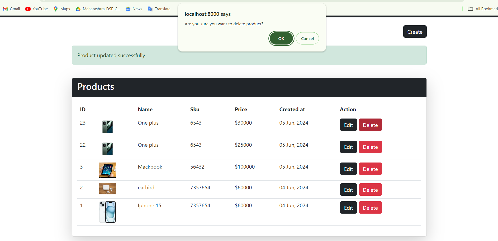

# Getting Started with Create Larvel Framework Appliction

Larvel Application
In the project directory, you can install:

###comprasor create-project laravel/laravel:11^0 laravelcurd

You can run project:

### php artisan serve

For Backend

### Mysql

Home page

